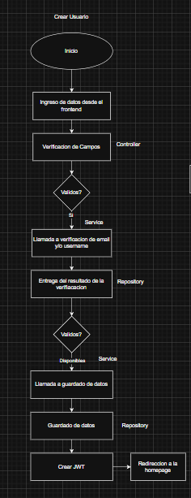
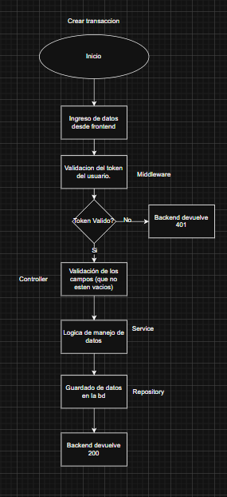
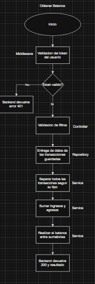

# 📊 Finance Tracker API

API REST para la gestión de finanzas personales, desarrollada con **Node.js** y **Express**, siguiendo una arquitectura **Route → Controller → Service → Repository**, con autenticación basada en **JWT**.

Este proyecto sirve como base para una aplicación web o móvil de control de ingresos, gastos y balance personal.

---

## 🚀 Características

- ✅ Registro de usuarios (Signup)
- ✅ Inicio de sesión (Login)
- ✅ Autenticación con JWT
- ✅ Gestión de transacciones (ingresos y egresos)
- ✅ Cálculo de balance por usuario
- ✅ Middleware de autenticación
- ✅ Arquitectura desacoplada y escalable
- ✅ Repositorios mockeados (sin base de datos aún)

---

## 🧱 Arquitectura del proyecto

El proyecto sigue una separación clara de responsabilidades:

```
src/
├── routes/ # Definición de endpoints
├── controllers/ # Manejo de request / response
├── services/ # Lógica de negocio
├── repositories/ # Acceso a datos (mock)
├── middlewares/ # Autenticación y validaciones
├── app.js
└── server.js
```


### 🔄 Flujo de una petición

Route -> Controller -> Service -> Repository

Este enfoque permite:
- Mejor mantenimiento
- Código más limpio
- Fácil escalabilidad
- Pruebas unitarias más simples

---

## 📐 Diagramas de flujo

Los siguientes diagramas explican los principales flujos de la aplicación:

### 🧾 Registro de usuario (Signup)


### 🧾 Inicio de Sesión de usuarios (Login)


### 💸 Crear Transacciones


### 📊 Cálculo de Balance


### 🔐 Autenticación
La API utiliza JSON Web Tokens (JWT) para autenticar usuarios.
#### Flujo de autenticación
1. El usuario inicia sesión
2. Se validan las credenciales
3. Se genera un token JWT
4. El token se devuelve al frontend
5. El frontend lo almacena (localStorage / secure storage)
6. Las rutas protegidas validan el token con un middleware

#### Header requerido
```Authorization: Bearer <token>```

### 📌 Endpoints Principales
#### 🔑 Auth
| Método | Endpoint  | Descripción         |
| ------ | --------- | ------------------- |
| POST   | `/signup` | Registro de usuario |
| POST   | `/login`  | Inicio de sesión    |

#### 💸 Transacciones
| Método | Endpoint        | Descripción       |
| ------ | --------------- | ----------------- |
| POST   | `/transactions` | Crear transacción |
| GET    | `/balance`      | Obtener balance   |
> Todas las rutas protegidas requiren autentificación

### 🧪 Datos de prueba (Mock)
Actualmente, la capa Repository utiliza datos en memoria para simular una base de datos real.

Esto permite:
* Probar la API sin configurar una BD

* Validar la lógica de negocio

* Mantener el enfoque en arquitectura y flujos

### 🛠️ Tecnologías usadas

* Node.js

* Express

* JSON Web Tokens (JWT)

* bcrypt

* JavaScript (ES6+)

### ⚙️ Instalación y ejecución
Clona el repositorio:

```
git clone https://github.com/tu-usuario/finance-tracker-api.git

cd finance-tracker-api
```

Instala dependencias:

``` 
npm install 
```

Configura variables de entorno (.env):
```
PORT=3000
JWT_SECRET=super_secret_key
```

Ejecuta el servidor:
```
npm run dev
```

### 📈 Próximas mejoras
*  Integración con PostgreSQL

* Validaciones con Joi o Zod

* Refresh tokens

* Tests unitarios con Jest

* Documentación con Swagger

* Integración con APIs bancarias

### 👨‍💻 Autor
**Sebastián Rodas**

Estudiante de Ingeniería en Sistemas

Apasionado por Backend, Arquitectura de Software y Desarrollo Web


